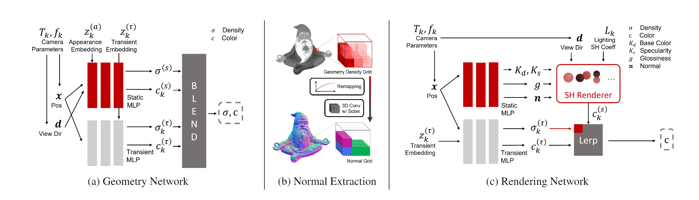
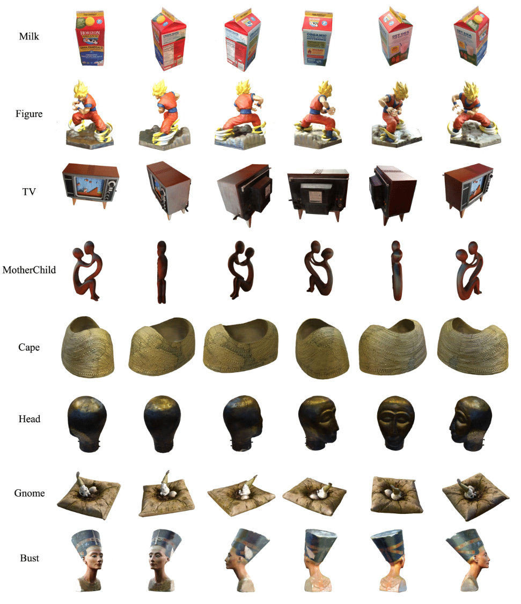
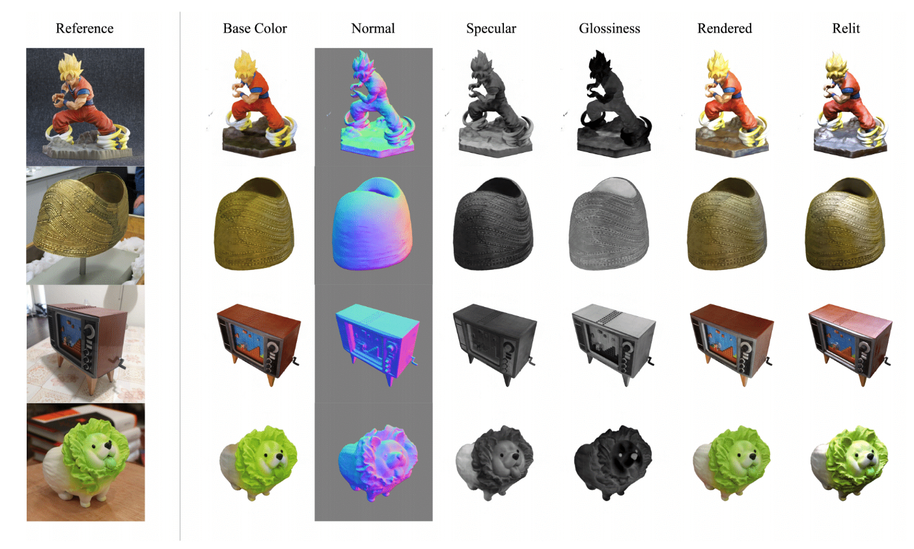

# NeROIC: Neural Object Capture and Rendering from Online Image Collections

This repository is the official implementation of  the NeROIC model from [NeROIC: Neural Object Capture and Rendering from Online Image Collections](https://arxiv.org/abs/2201.02533) by [Zhengfei Kuang](https://zhengfeikuang.com), [Kyle Olszewski](https://kyleolsz.github.io/), [Menglei Chai](https://mlchai.com/), [Zeng Huang](https://zeng.science/), [Panos Achlioptas](https://optas.github.io/), and [Sergey Tulyakov](http://stulyakov.com).

This work has been tested on Ubuntu 20.04. 

Our project page is https://formyfamily.github.io/NeROIC.

## Quick Start
* Install required libraries.

```sh
conda env create -f environment.yaml
conda activate neroic
apt-get install graphicsmagick-imagemagick-compat
```

* Download our example data at [here](https://drive.google.com/drive/folders/1HzxaO9CcQOcUOp32xexVYFtsyKKULR7T?usp=sharing).

* Optimize the geometry network.

```bash
python train.py \
--config <path_of_the_geometry_stage_config_file> \
--datadir <path of the data> 
```

for example:

```bash
python train.py \
--config configs/milkbox_geometry.yaml \
--datadir ./data/milkbox_dataset
```

(Optional) running the script with multiple GPU is a bit tricky: you should first run it a single GPU (which will generate the resized images), then stop the process before the training starts. Then run:

```bash
CUDA_VISIBLE_DEVICES=0,1,2,3 python train.py \
--config <path_of_the_geometry_stage_config_file> \
--datadir <path of the data> \
--num_gpus 4
```

* Extract the normal from learned geometry.

```bash
python generate_normal.py \
 --config <path_of_the_geometry_stage_config_file> \
 --ft_path <path_of_the_geometry_network_weight_file> \
--datadir <path of the data> 
```

for example: 

```bash
python generate_normal.py \
--config configs/milkbox_geometry.yaml \
--ft_path logs/milkbox_geometry/epoch=29.ckpt \
--datadir data/milkbox_dataset
```

* Optimize the rendering network.

```bash
python train.py \
--config <path_of_the_rendering_stage_config_file> \
--ft_path <path_of_the_geometry_network_weight_file> \
--datadir <path of the data> 
```
for example (training with 4 GPUs): 

```bash
CUDA_VISIBLE_DEVICES=0,1,2,3 python train.py \
--config configs/milkbox_rendering.yaml \
--ft_path logs/milkbox_geometry/epoch=29.ckpt \
--datadir data/milkbox_dataset \
--num_gpus 4
```

training logs & results will be saved at `logs/`.

## Video Generation
the video of novel testing views is generated on-the-fly during training, and saved under `logs/`. To render video with a pre-trained model, run:

```bash
python train.py \
--config <path_of_the_config_file> \
--ft_path <path_of_the_model_weight_file> \
--datadir <path of the data> \
--i_video 1 \ 
(optional) --test_img_id <index_of_the_reference_image>
```

## Testing
We provide additional testing scripts for material decomposition and relighting. 

To decompose materials:

```bash
python test_material.py \
--config <path_of_the_rendering_stage_config_file> \
--ft_path <path_of_the_rendering_network_weight_file> \
--datadir <path of the data> 
```

To relight the model (panoramic exr HDRI maps are prefered):

```bash
python test_relighting.py \
--config <path_of_the_rendering_stage_config_file> \
--ft_path <path_of_the_rendering_network_weight_file> \
--datadir <path of the data> \
--test_env_filename <path_of_the_envrionment_map> 
```

## Bring Your Own Data

Coming Soon

## Model Overview

Our two-stage model takes images of an object from different conditions as input. 
With the camera poses of images and object foreground masks acquired by other state-of-the-art methods, 
We first optimize the geometry of scanned object and refine camera poses by training a NeRF-based network; 
We then compute the surface normal from the geometry (represented by density function) using our normal extraction layer;
Finally, our second stage model decomposes the material properties of the object and solves for the lighting conditions for each image. 



## Novel View Synthesis

Given online images from a common object, our model can synthesize novel views of the object with the lighting conditions from the training images.

https://user-images.githubusercontent.com/8952528/148708746-14c2db49-2516-4e31-a1be-559be4480b01.mp4



## Material Decomposition

https://user-images.githubusercontent.com/8952528/148708751-7fb1c820-57d3-454f-a411-635c141fab18.mp4



## Relighting

https://user-images.githubusercontent.com/8952528/148708757-f7c981f0-3963-49cb-a492-4fae73429105.mp4

## Citation

If you find this useful, please cite the following:
```bibtex
@article{10.1145/3528223.3530177,
author = {Kuang, Zhengfei and Olszewski, Kyle and Chai, Menglei and Huang, Zeng and Achlioptas, Panos and Tulyakov, Sergey},
title = {NeROIC: Neural Rendering of Objects from Online Image Collections},
year = {2022},
issue_date = {July 2022},
publisher = {Association for Computing Machinery},
address = {New York, NY, USA},
volume = {41},
number = {4},
issn = {0730-0301},
url = {https://doi.org/10.1145/3528223.3530177},
doi = {10.1145/3528223.3530177},
journal = {ACM Trans. Graph.},
month = {jul},
articleno = {56},
numpages = {12},
keywords = {neural rendering, reflectance & shading models, multi-view & 3D}
}
```

Acknowledgements: This work borrows many code from [NeRF-pl](https://github.com/kwea123/nerf_pl). We thank the author for releasing his code.